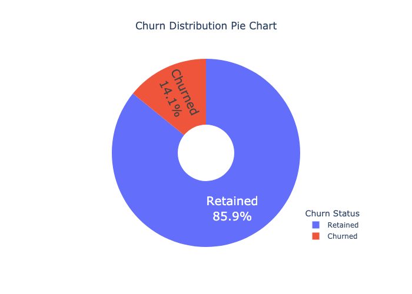

# Telecommunication Customer Churn Analysis

## 1. Project Overview
This project explores a dataset of telecommunications customers to uncover patterns that signal whether customers are likely to discontinue their services. Utilizing a variety of data science methods and machine learning models, this analysis delivers crucial insights into the factors influencing customer churn and suggests ways to mitigate it.

## 2. Dataset
The dataset, [Telecom Customer Churn](./files/telecom_customer_churn.csv), comprises several customer attributes including monthly charges, contract duration, and whether an international plan is subscribed. 

An initial exploration of this dataset is captured in [Data Summary](./files/data_summary.txt), obtained from [Kaggle](https://www.kaggle.com/datasets/mnassrib/telecom-churn-datasets/data?select=churn-bigml-20.csv).

### 2.1 Dats summary

The [Data Summary](./files/data_summary.txt) file provides a comprehensive overview of the telecom dataset, detailing essential attributes such as the number of rows (customers) and columns (features). This document reveals significant aspects such as:
- **Data Types and Null Values**: By outlining the data types and null value counts, this summary helps identify columns that may require preprocessing, such as filling missing values or converting data types for better analysis compatibility.
- **Initial Insights**: The first five rows preview typical entries, providing a snapshot of the customer base, including varied demographics and service usage patterns. This initial look can help hypothesize about potential factors influencing churn, such as service type or customer demographics.
- **Foundation for Deeper Analysis**: Understanding the basic structure and content of the dataset is crucial for setting up more detailed data cleaning procedures and preparing for in-depth exploratory data analysis and feature engineering.

## 3. Visualizations
Several visualizations have been developed to deeply analyze various aspects of the dataset.

### 3.1 Dataset Distributions

 

This visualization illustrates the distribution of all numeric features within the dataset, helping identify data scaling needs, potential outliers, and normalization requirements.

### 3.2 Churn Distribution Pie Chart

  

The pie chart visually expresses the proportion of customers who have churned versus those who have stayed. It offers a rapid assessment of the churn rate, essential for understanding the scope of customer retention challenges.

### 3.3 International Plan Distribution

 

The histogram  delves into how international plans affect churn rates, suggesting that customers with such plans might display a higher churn rate due to additional costs or service expectations.

## 4. Models
Three predictive models were developed: Logistic Regression, Random Forest, and Naive Bayes, each tested for their ability to predict customer churn.

### 4.1 Detailed Model Performance

The performance evaluations detailed in [Detailed Model Performance](./files/detailed_model_performance.txt) reveal nuanced insights:

- **Logistic Regression**: Although it shows moderate overall effectiveness with an AUC of approximately 0.80, it excels in identifying the significant predictors of churn. Its precision of 75% indicates its strength in accurately predicting churn when it does occur, but a recall of 60% points to missed cases of churn. This model is particularly useful for initial screenings and providing a baseline understanding of feature impacts.

- **Random Forest**: This model achieves the highest AUC of about 0.85, suggesting its superior capability in distinguishing between churned and retained customers. With high precision and recall, it confirms its robustness in various scenarios, making it ideal for deploying in proactive churn prevention strategies. Its ability to handle complex interactions between features without explicit feature engineering makes it particularly valuable.

- **Naive Bayes**: Despite its simplicity and faster computation times, Naive Bayes lags in performance with lower precision and recall, indicating a tendency to misclassify more customers than the other models. However, it serves as an excellent baseline and can be useful for quick, rough estimates of churn likelihood, especially in large datasets where speed is a concern.

### 4.2 ROC Curves Comparison

  

This graph displays the Receiver Operating Characteristic (ROC) curves for each trained model. The ROC curves reveal that while all models perform above the baseline, the Random Forest model demonstrates the best ability to discriminate between churned and retained customers, with the highest area under the curve (AUC). This suggests that the Random Forest model is the most effective tool for predicting customer churn, potentially due to its ability to handle unbalanced datasets and its robustness against overfitting.

## 5. Interpretations and Conclusions
The analysis clearly reveals that specific features like international plans and monthly charges significantly correlate with customer churn. Customers with international plans are particularly prone to churn, likely due to dissatisfaction with the cost or the service provided. 

## 6. Recommendations

Based on the insights obtained, it is recommended that telecommunications companies:

- Reevaluate the pricing and benefits of international plans to align better with customer expectations, thus enhancing satisfaction and reducing churn.
- Implement targeted retention strategies that leverage the predictive power of the Random Forest model to identify and intervene with high-risk customers before they churn.
- Consider customer feedback from churned customers, especially those with international plans, to adjust services and improve customer satisfaction metrics.