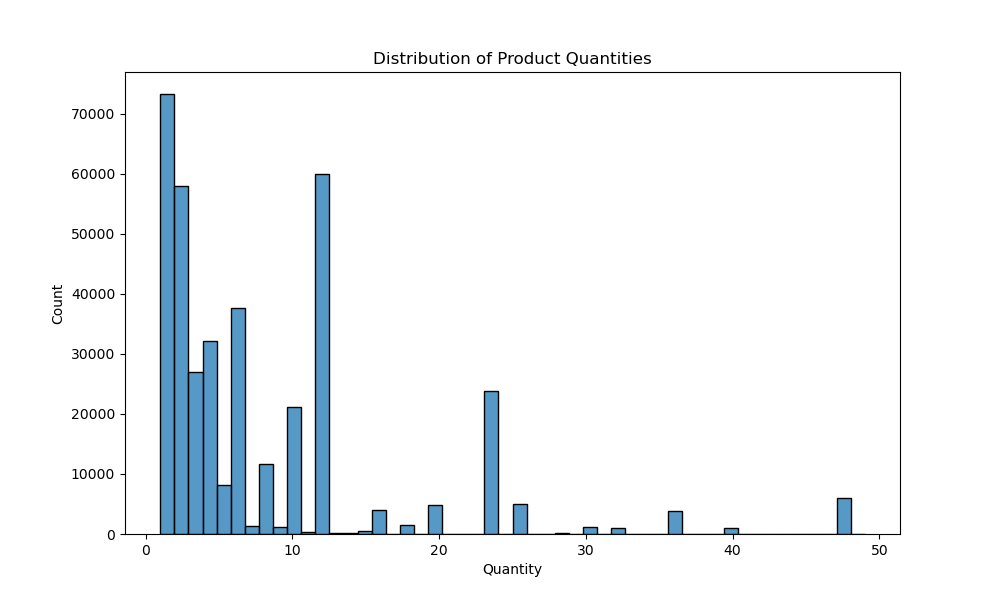
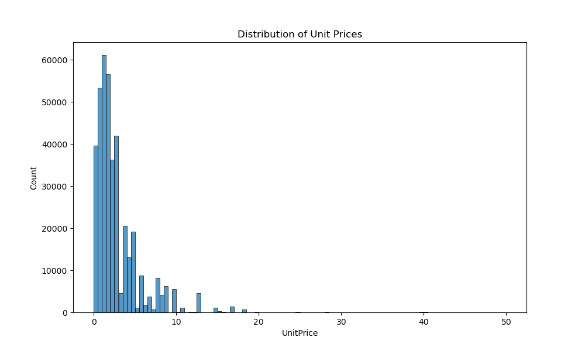
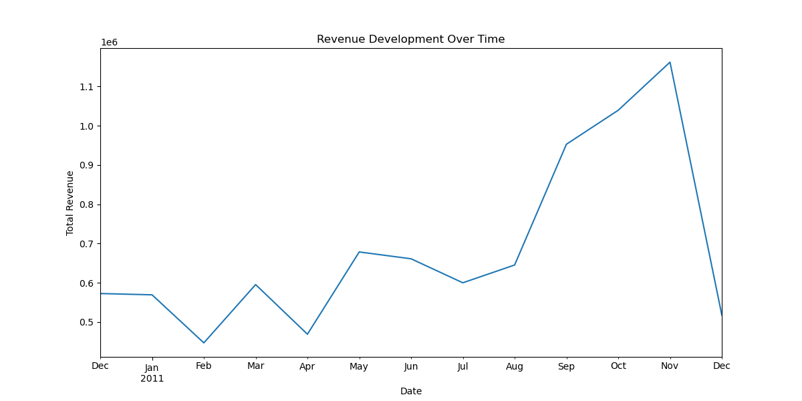
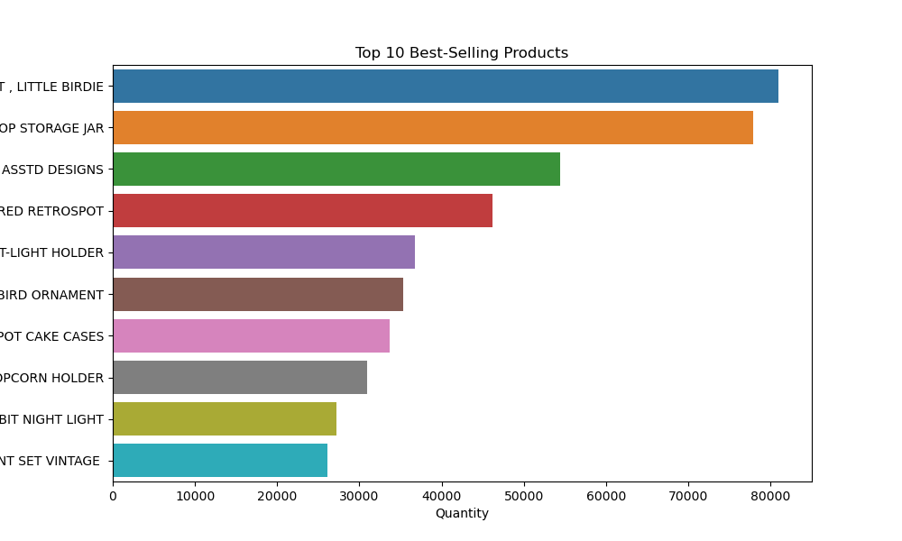
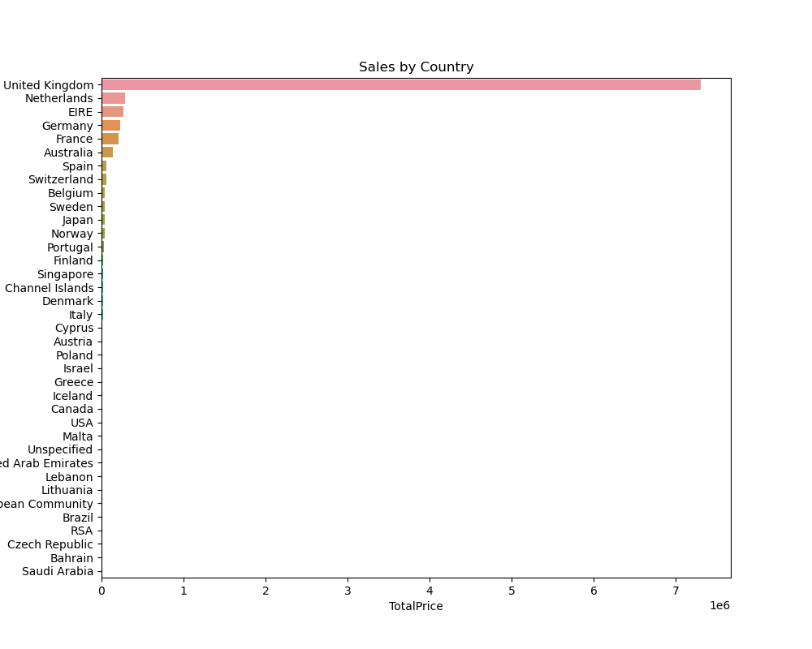
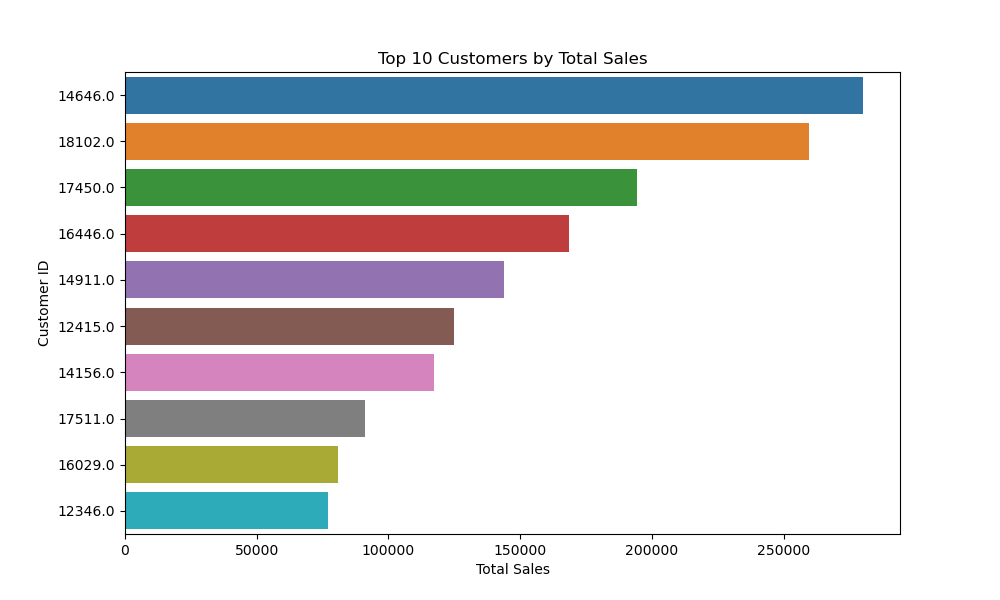
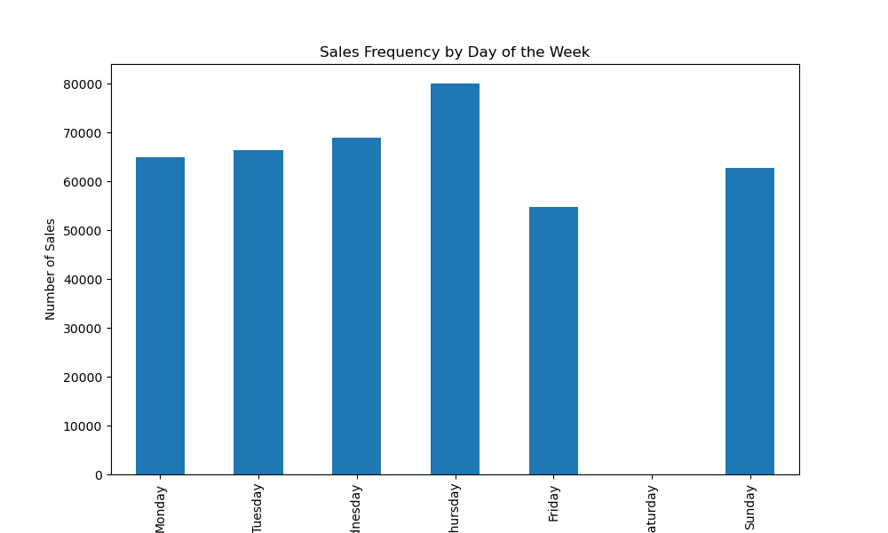
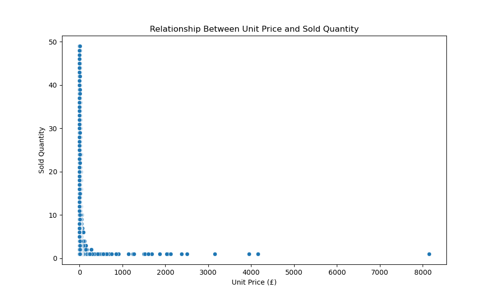
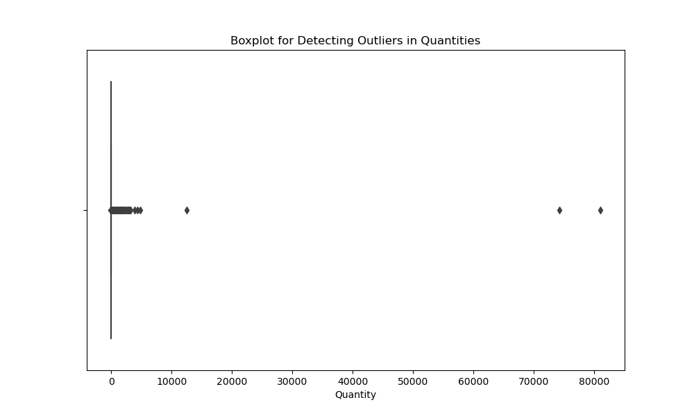

# Exploratory Data Analysis of the Online Retail Dataset

## Overview

This README documents the exploratory data analysis (EDA) of a dataset that includes transactions from an online store. The aim of the analysis is to gain insights into sales patterns, customer trends, and pricing structures.

## Dataset

The dataset used in this analysis, `online_retail.csv`, is sourced from Kaggle. It can be accessed at the following URL: [Online Retail Dataset on Kaggle](https://www.kaggle.com/datasets/ulrikthygepedersen/online-retail-dataset).

The `online_retail.csv` dataset contains the following key columns:
- `InvoiceNo`: Invoice number
- `StockCode`: Product code
- `Description`: Product description
- `Quantity`: Quantity sold
- `InvoiceDate`: Date of the invoice
- `UnitPrice`: Price per unit
- `CustomerID`: Customer identification number
- `Country`: Country of the customer

## Data Preparation

### Data Cleaning

Data was first checked for missing values and cleaned accordingly. Transactions without a `CustomerID` and canceled transactions (those where `InvoiceNo` starts with 'C') were removed to ensure data quality.

### Conversion

The `InvoiceDate` column was converted to datetime format to facilitate time series analysis.

## Descriptive Statistics

Basic descriptive statistics were generated to provide an overview of the data, including mean, median, and standard deviation, which help identify general trends and outliers in the dataset.

## Data Visualization and Analysis

### Distribution of Product Quantities

The histogram of product quantities shows most products are purchased in small quantities, indicating typical consumer buying behavior.

### Distribution of Unit Prices

The histogram of unit prices reveals that most items are priced below £50, with a high concentration of products in the lower price range.

### Revenue Development Over Time

The time series plot of total revenue shows fluctuations that might correlate with specific seasons or promotional events, indicating important sales periods.

### Top 10 Best-Selling Products

This bar chart highlights the products with the highest quantities sold, showcasing which items are most popular among customers.

### Sales by Country

The sales by country analysis indicates the geographical distribution of sales, highlighting which countries generate the most revenue.

### Top 10 Customers by Total Sales

Identifying top customers by total sales helps in recognizing valuable customers who contribute significantly to revenue.

### Sales Frequency by Day of the Week

This bar chart shows the number of sales transactions for each day of the week, indicating peak sales days and helping in planning for demand.

### Relationship Between Unit Price and Sold Quantity

The scatter plot examines the relationship between unit price and quantity sold, helping to understand pricing strategies' impact on sales volume.

## Outliers Detection

A boxplot for quantities was used to identify outliers in the data, which could be due to bulk purchases or data entry errors.

This comprehensive analysis provides critical insights into the operations of the online store, guiding future business strategies and customer engagement plans.

## Conclusions

The exploratory data analysis of the online retail dataset has yielded several valuable insights that can significantly influence business strategies and operational decisions:

1. **Variety in Product Types and Sales Patterns**: The analysis highlights a diverse range of products, with varying levels of demand and sales patterns. This diversity underscores the need for a segmented inventory and marketing strategy that can cater to the different consumer preferences and buying behaviors observed across the dataset.

2. **Seasonal Trends and Customer Segments**: The revenue development over time graph illustrates clear seasonal trends, with peaks likely corresponding to holidays and specific promotions. These trends suggest that strategic planning for inventory management and marketing campaigns should be aligned with these peak periods to maximize sales. Additionally, the identification of distinct customer segments, particularly those who contribute most significantly to revenue, allows for targeted marketing strategies and personalized promotions to enhance customer loyalty and increase sales.

3. **Geographical Sales Distribution**: The sales by country analysis provides a clear indication of where the majority of the sales are concentrated. This geographical insight is crucial for optimizing logistics and distribution strategies. Markets with high sales volumes may benefit from increased inventory and localized marketing campaigns, whereas emerging markets might require different strategies, such as introductory promotions or partnerships, to increase market penetration.

4. **Day of the Week Sales Patterns**: Understanding which days generate the most sales can help in planning staffing and stock levels. This can lead to more efficient operations and improved customer satisfaction by ensuring that the business is well-prepared for periods of high demand.

5. **Price Elasticity and Sales Volume**: The relationship between unit price and sold quantity highlights how pricing strategies affect sales volumes. The data suggests that lower-priced items tend to sell in higher quantities, which could indicate a price-sensitive customer base. Adjusting prices or increasing promotional activities could be used to drive volume in higher-priced segments.

6. **Outliers Detection**: The identification of outliers, particularly in the quantities sold, points to occasional bulk purchases or possible data entry errors. These outliers need to be investigated to ensure accuracy in forecasting and inventory management. They may also reveal opportunities for bulk sales promotions or special offers that could appeal to larger buyers.

### Strategic Recommendations

Based on these conclusions, several strategic recommendations can be made:
- **Inventory Management**: Align stock levels with the clear patterns of demand seen in seasonal trends and day-of-the-week sales data to reduce overstock and stockouts.
- **Customer Relationship Management**: Develop loyalty programs and personalized marketing campaigns for top customers and those in high-sales countries to enhance customer retention.
- **Pricing Strategy**: Conduct further analysis on the price elasticity of products to fine-tune pricing strategies, potentially implementing dynamic pricing models where appropriate.
- **Marketing and Promotions**: Plan major sales promotions around peak seasonal periods, using data-driven insights to target promotions effectively and maximize revenue.

In summary, the exploratory data analysis provides a robust foundation for data-driven decision-making, offering insights that can help optimize various aspects of business operations from marketing to supply chain management. Implementing the strategies based on these findings could lead to increased sales, improved customer satisfaction, and enhanced operational efficiency.

