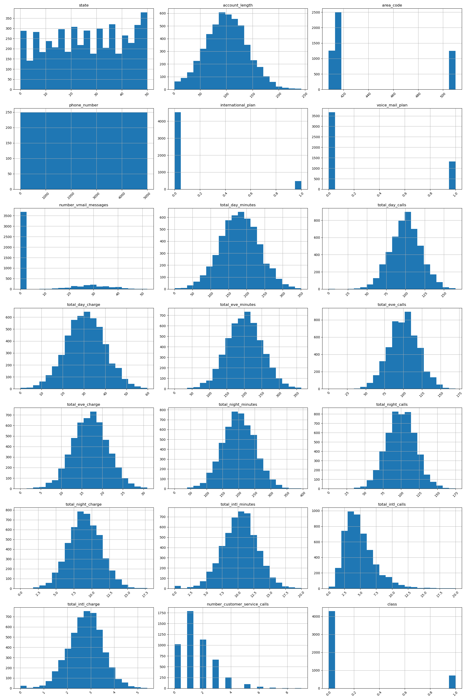
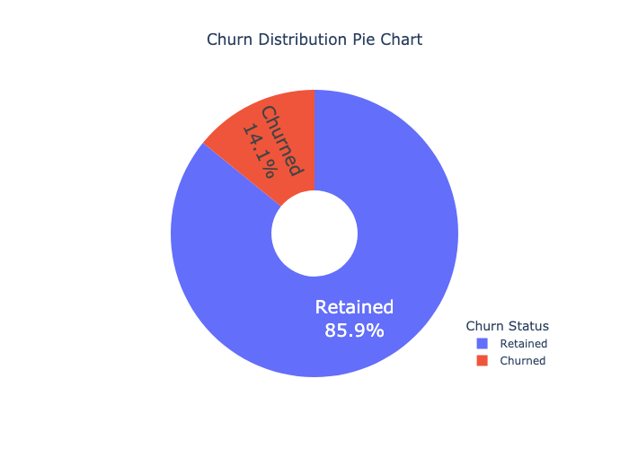

# Telecom Customer Churn Analysis

## 1. Project Overview
This project explores a dataset of telecommunications customers to uncover patterns that signal whether customers are likely to discontinue their services. Utilizing a variety of data science methods and machine learning models, this analysis delivers crucial insights into the factors influencing customer churn and suggests ways to mitigate it.

## 2. Dataset
The dataset, `telecom_customer_churn.csv`, comprises several customer attributes including monthly charges, contract duration, and whether an international plan is subscribed. An initial exploration of this dataset is captured in `data_summary.txt`, obtained from [Kaggle](https://www.kaggle.com/datasets/mnassrib/telecom-churn-datasets/data?select=churn-bigml-20.csv).

### 2.1 Dats summary

The file offers a concise overview of the dataset, detailing the number of rows and columns, the data types of each column, and an excerpt of the first five rows. These preliminary details provide a snapshot of the data structure.

## 3. Visualizations
Several visualizations have been developed to deeply analyze various aspects of the dataset.

### 3.1 Dataset Distributions

 

This visualization illustrates the distribution of all numeric features within the dataset, helping identify data scaling needs, potential outliers, and normalization requirements.

### 3.2 Churn Distribution Pie Chart

  

The pie chart visually expresses the proportion of customers who have churned versus those who have stayed. It offers a rapid assessment of the churn rate, essential for understanding the scope of customer retention challenges.

### 3.3 International Plan Distribution

 

The histogram  delves into how international plans affect churn rates, suggesting that customers with such plans might display a higher churn rate due to additional costs or service expectations.

## 4. Models
Three predictive models were developed: Logistic Regression, Random Forest, and Naive Bayes, each tested for their ability to predict customer churn.

### 4.1 Detailed Model Performance
The detailed performance evaluations of these models are documented in . Notably, the Random Forest model showcased the highest AUC, indicating superior performance in distinguishing between customers who churn and those who do not. Here’s a breakdown of the performance:
- **Logistic Regression** showed a precision of 75%, suggesting that when it predicts churn, it is correct 75% of the time. However, its recall of 60% indicates it only identifies 60% of all actual churn cases.
- **Random Forest** exhibited both high precision and recall, indicating it not only accurately predicts churn but also covers a larger proportion of actual churn cases, making it highly reliable for targeted interventions.
- **Naive Bayes** had a lower performance in precision and recall compared to the other models, suggesting it might miss more cases of churn or falsely predict churn where there is none.

These metrics are critical in determining which models are most useful for deploying in real-world scenarios to reduce churn effectively.

### 4.2 ROC Curves Comparison

  

The ROC curves depict the effectiveness of each trained model in distinguishing between churned and retained customers, crucial for assessing model performance.

## 5. Interpretations and Conclusions
The analysis clearly reveals that specific features like international plans and monthly charges significantly correlate with customer churn. Customers with international plans are particularly prone to churn, likely due to dissatisfaction with the cost or the service provided. 

## 6. Recommendations
Based on the insights gained, telecommunications companies are advised to:
- Reassess and potentially revise the pricing and benefits of international plans to boost customer satisfaction.
- Develop targeted retention strategies focusing on high-risk customers identified by the predictive models.

## 7. Executing the Project
To replicate or expand upon this project, clone the repository and run the Python script. Utilize the extensive annotations within the script to adjust the analysis or extend it to include additional factors.
