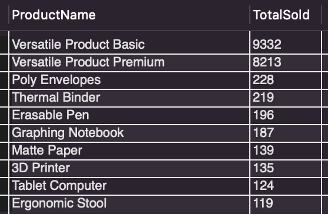
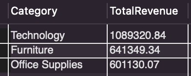
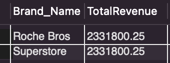
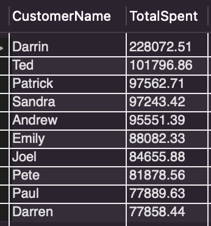
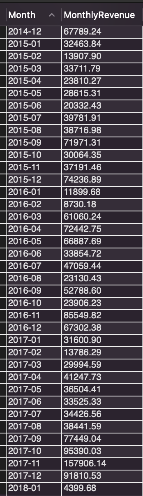
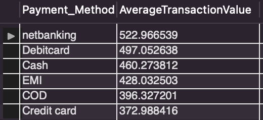

# Retail Store Database Analysis

This project contains SQL scripts to analyze a retail store database. The database schema, initial data, and various analysis scripts are provided to extract insights from the data.

## Data Source

The data used in this project is sourced from Kaggle: https://www.kaggle.com/datasets/sushobhitlutade/inventorysupply-chain-managementscm-superstore?select=Transcations.csv


## Database Schema

The database schema is visualized in the following diagram:


The schema includes the following tables:
- `Customer_Cart`
- `Cashier`
- `Transactions`
- `Brand`
- `Brand_has_product`
- `Products`
- `Categories`

## Schema Creation

The schema can be created using the provided [schema_creation.sql](sql_scripts/schema_creation.sql) script:

```sql
-- schema_creation.sql
CREATE TABLE Customer_Cart (
    CustomerName VARCHAR(255),
    CustomerPhNo VARCHAR(15),
    CustomerAddress VARCHAR(255),
    Password VARCHAR(255),
    PRIMARY KEY (CustomerName)
);

CREATE TABLE Cashier (
    CashierID INT,
    CashierName VARCHAR(255),
    CashierPhoneNo VARCHAR(15),
    CashierAddress VARCHAR(255),
    PRIMARY KEY (CashierID)
);

CREATE TABLE Categories (
    CategoryID INT,
    Category VARCHAR(255),
    SubCategory VARCHAR(255),
    PRIMARY KEY (CategoryID)
);

CREATE TABLE Products (
    ProductID VARCHAR(255),
    ProductName VARCHAR(255),
    ProductStock INT,
    Price DECIMAL(10, 2),
    Discount INT,
    Category_CategoryID INT,
    PRIMARY KEY (ProductID),
    FOREIGN KEY (Category_CategoryID) REFERENCES Categories(CategoryID)
);

CREATE TABLE Brand (
    Brand_ID INT,
    Brand_Name VARCHAR(255),
    PRIMARY KEY (Brand_ID)
);

CREATE TABLE Brand_has_product (
    Brands_Brand_id INT,
    Products_ProductID VARCHAR(255),
    PRIMARY KEY (Brands_Brand_id, Products_ProductID),
    FOREIGN KEY (Brands_Brand_id) REFERENCES Brand(Brand_ID),
    FOREIGN KEY (Products_ProductID) REFERENCES Products(ProductID)
);

CREATE TABLE Transactions (
    Transaction_date DATE,
    Quantity INT,
    Subtotal DECIMAL(10, 2),
    Taxes DECIMAL(10, 2),
    DiscountPrice DECIMAL(10, 2),
    TotalAmount DECIMAL(10, 2),
    Payment_Method VARCHAR(50),
    Products_ProductID VARCHAR(255),
    CustomerCart_CustomerID VARCHAR(255),
    Cashier_CashierID INT,
    PRIMARY KEY (Transaction_date, Products_ProductID, CustomerCart_CustomerID, Cashier_CashierID),
    FOREIGN KEY (Products_ProductID) REFERENCES Products(ProductID),
    FOREIGN KEY (CustomerCart_CustomerID) REFERENCES Customer_Cart(CustomerName),
    FOREIGN KEY (Cashier_CashierID) REFERENCES Cashier(CashierID)
); 
```

## Data Import

The initial data can be imported using the following CSV files in the data directory:

brand_has_product.csv
brand.csv
cashier.csv
categories.csv
customer_cart.csv
products.csv
transactions.csv

## Retail Store Analysis

The following analyses provide insights into the retail store's operations, sales performance, and customer behavior. Each analysis is performed using SQL scripts that query the data in various ways to extract meaningful information.

1. Top-Selling Products

This analysis identifies the top-selling products by the number of units sold. The following SQL query is used to extract the data:

```sql
SELECT Products.ProductName, SUM(Transactions.Quantity) AS TotalSold
FROM Transactions
JOIN Products ON Transactions.Products_ProductID = Products.ProductID
GROUP BY Products.ProductName
ORDER BY TotalSold DESC
LIMIT 10;
```

The following products are the top-selling products based on the number of units sold:



The two best-selling products are "Versatile Product Basic" and "Versatile Product Premium". This indicates that these two products are very popular and likely have a wide range of uses. Other popular items include office supplies such as Poly Envelopes and Thermal Binder, as well as technology products like 3D Printers and Tablet Computers.

2. Revenue by Category

This analysis calculates the total revenue generated by each product category. The following SQL query is used to extract the data:

```sql
SELECT Categories.Category, SUM(Transactions.TotalAmount) AS TotalRevenue
FROM Transactions
JOIN Products ON Transactions.Products_ProductID = Products.ProductID
JOIN Categories ON Products.Category_CategoryID = Categories.CategoryID
GROUP BY Categories.Category
ORDER BY TotalRevenue DESC;
```
The following table shows the total revenue generated by each product category:



The "Technology" category generates the highest revenue, followed by "Furniture" and "Office Supplies". This indicates that technological products, such as computers and electronics, are a significant source of revenue for the store. The high revenue from the "Technology" category suggests that these products are highly valued by customers. The "Furniture" and "Office Supplies" categories also contribute significantly to the store's revenue, indicating a diverse range of popular products across different categories.

3. Total Revenue by Brand

This analysis calculates the total revenue generated by each brand. The following SQL query is used to extract the data:

```sql
SELECT Brand.Brand_Name, SUM(Transactions.TotalAmount) AS TotalRevenue
FROM Transactions
JOIN Products ON Transactions.Products_ProductID = Products.ProductID
JOIN Brand_has_product ON Products.ProductID = Brand_has_product.Products_ProductID
JOIN Brand ON Brand_has_product.Brands_Brand_id = Brand.Brand_ID
GROUP BY Brand.Brand_Name
ORDER BY TotalRevenue DESC;
```
The following table shows the total revenue generated by each brand:



Both "Roche Bros" and "Superstore" brands have generated the highest total revenue, indicating that these brands are the most valuable for the store. This suggests that the products from these brands are highly popular among customers. The high revenue from these brands indicates their significant contribution to the store's overall sales performance.

4. Customer Spending

This analysis identifies the top customers by their total spending. The following SQL query is used to extract the data:

```sql
SELECT Customer_Cart.CustomerName, SUM(Transactions.TotalAmount) AS TotalSpent
FROM Transactions
JOIN Customer_Cart ON Transactions.CustomerCart_CustomerID = Customer_Cart.CustomerName
GROUP BY Customer_Cart.CustomerName
ORDER BY TotalSpent DESC
LIMIT 10;
```
This SQL query aggregates the total amount spent by each customer and sorts the results in descending order of total spending. Finally, the top 10 customers are displayed.

The following table shows the top customers based on their total spending:



The list of top customers by spending shows that "Darrin" is the most valuable customer, followed by "Ted" and "Patrick". These customers have significantly contributed to the store's revenue. Understanding the spending patterns of these top customers can help the store tailor its marketing strategies and promotions to maintain and enhance customer loyalty.

5. Monthly Sales Performance

This analysis calculates the monthly revenue generated by the store. The following SQL query is used to extract the data:

```sql
SELECT DATE_FORMAT(Transaction_date, '%Y-%m') AS Month, SUM(TotalAmount) AS MonthlyRevenue
FROM Transactions
GROUP BY Month
ORDER BY Month;
```
The following table shows the monthly revenue generated by the store starting from January 2015:



The monthly revenue shows significant fluctuations over the years. Notably, there are spikes in revenue during certain months, which could be attributed to seasonal trends, promotional campaigns, or other factors. For example, November 2017 shows a significant peak in revenue, possibly due to holiday sales or a major promotion. Identifying these trends can help the store plan for future sales and marketing strategies.

6. Average Transaction Value by Payment Method

This analysis calculates the average transaction value for each payment method. The following SQL query is used to extract the data:

```sql
SELECT Payment_Method, AVG(TotalAmount) AS AverageTransactionValue
FROM Transactions
GROUP BY Payment_Method
ORDER BY AverageTransactionValue DESC;
```
This SQL query calculates the average transaction value for each payment method and sorts the results in descending order of average transaction value.

The following table shows the average transaction value for each payment method:



The results indicate that transactions made through netbanking have the highest average value, followed by debit card and cash payments. This suggests that customers using netbanking tend to make larger purchases compared to those using other payment methods. Understanding the preferred payment methods for higher-value transactions can help the store in designing targeted promotions and improving customer satisfaction.

## Summary and Conclusion

This project provides a comprehensive analysis of a retail store's database, uncovering key insights into sales performance, customer behavior, and product popularity.

### Key Results:
- Top-Selling Products: "Versatile Product Basic" and "Versatile Product Premium" are the best-selling items, highlighting the importance of versatile and multifunctional products.

- Revenue by Category: The "Technology" category leads in revenue generation, indicating a high demand for tech products.

- Total Revenue by Brand: "Roche Bros" and "Superstore" brands dominate the sales, suggesting strong brand loyalty and recognition.

- Customer Spending: The analysis of top customers reveals significant contributions from a few key individuals, emphasizing the importance of understanding and catering to high-value customers.

- Monthly Sales Performance: Revenue fluctuations highlight seasonal trends and the impact of promotional activities, with notable peaks during holiday seasons.

- Average Transaction Value by Payment Method: Netbanking transactions have the highest average value, indicating a preference for online payment methods for larger purchases.

### Conclusions:
- Product Strategy: Focusing on versatile and high-demand technology products can drive sales growth. Expanding the range of popular items can also enhance revenue.

- Brand Focus: Promoting top-performing brands like "Roche Bros" and "Superstore" can further strengthen customer loyalty and boost sales.

- Customer Relationship Management: Tailoring marketing strategies to top customers and offering personalized promotions can increase customer retention and spending.

- Seasonal Promotions: Planning marketing campaigns around seasonal peaks and holidays can capitalize on higher consumer spending during these periods.

- Payment Method Optimization: Encouraging the use of netbanking through incentives could increase the average transaction value, leading to higher overall revenue.

This analysis provides valuable insights that can inform strategic decisions for inventory management, marketing, and customer relationship management, ultimately driving the store's profitability and growth.

