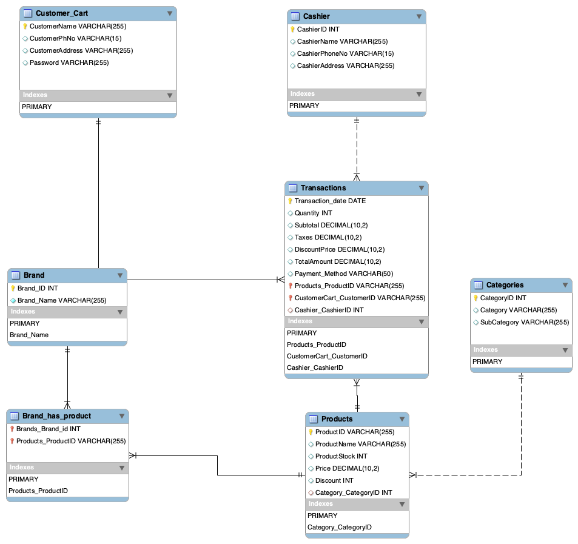

# Retail Store Database Analysis

This project contains SQL scripts to analyze a retail store database. The database schema, initial data, and various analysis scripts are provided to extract insights from the data.

## Database Schema

The database schema is visualized in the following diagram:



The schema includes the following tables:
- `Customer_Cart`
- `Cashier`
- `Transactions`
- `Brand`
- `Brand_has_product`
- `Products`
- `Categories`

## Schema Creation

The schema can be created using the provided [schema_creation.sql](/sql_scripts/schema_creation.sql) script:

```sql
-- schema_creation.sql
